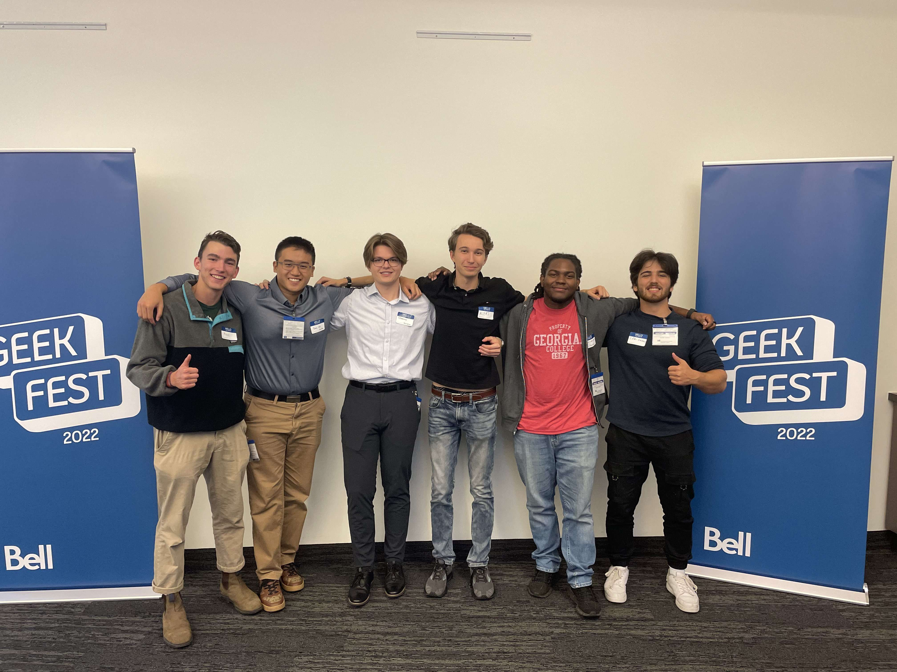


Teams from Georgian College win 1st and 3rd place at Bell Geekfest 2022.


[Comment: here I'm using HTML for the image because I want to put a figcaption]: #

<figure>
    
    <figcaption>From left-to-right: Paul, Tuany, Dominik, Aleksander, Akeem, Idan.</figcaption>
</figure>

Two teams composed of second-year CS students participated at the Bell Geekfest, held at Bell's office in Mississauga, Ontario.

This year's theme was diversity, equity, and inclusion. Teams had one week to work, losing sleep until Saturday, September 24th.

At the Bell office they finally handed off their work to the judges. There were also opportunities for a 15-20 minute speed interview to potentially land a job at Bell.

## Team 1 - Dominik, Aleksander, Akeem, Idan

*Talk about your project, challenges faced, and your experience on the last day*

## Team 2 - Paul, Tuany

*Talk about your project, challenges faced, and your experience on the last day*

Work in progress! :construction: