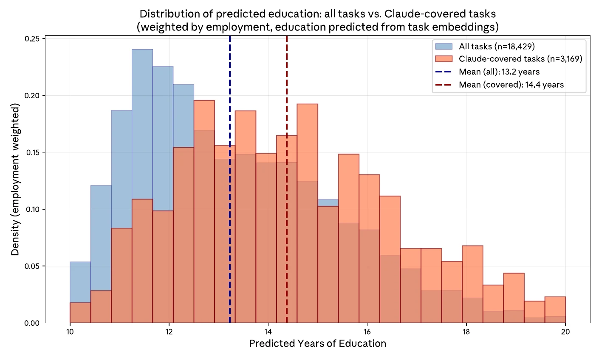
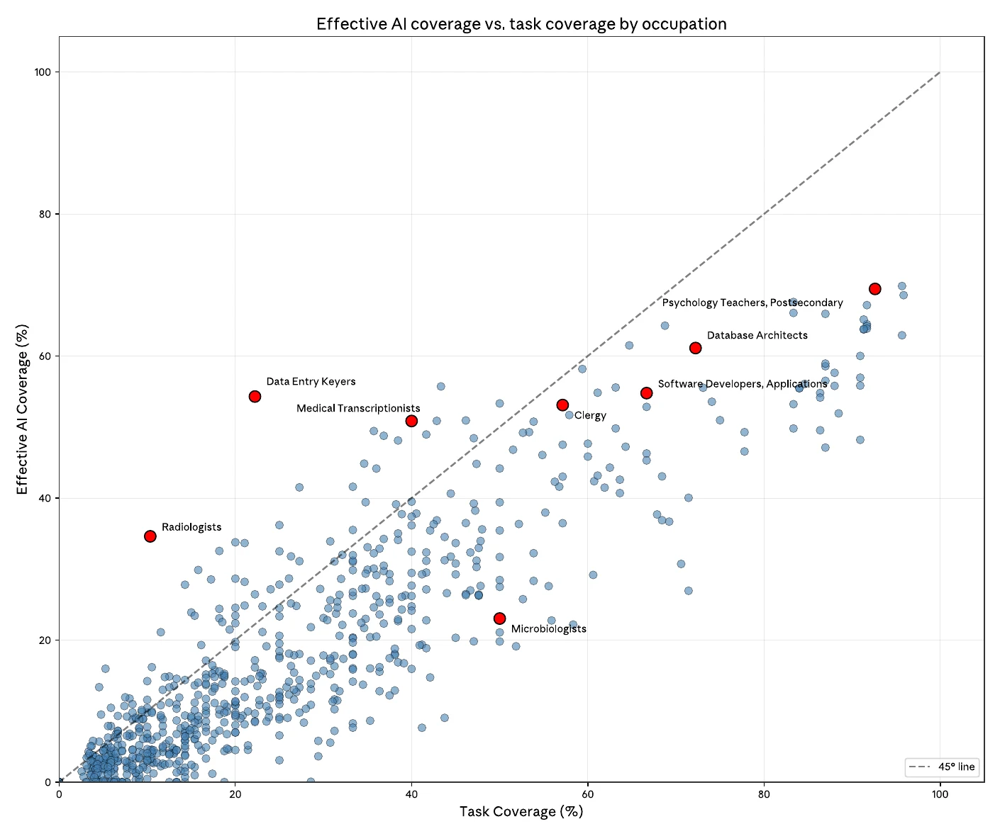
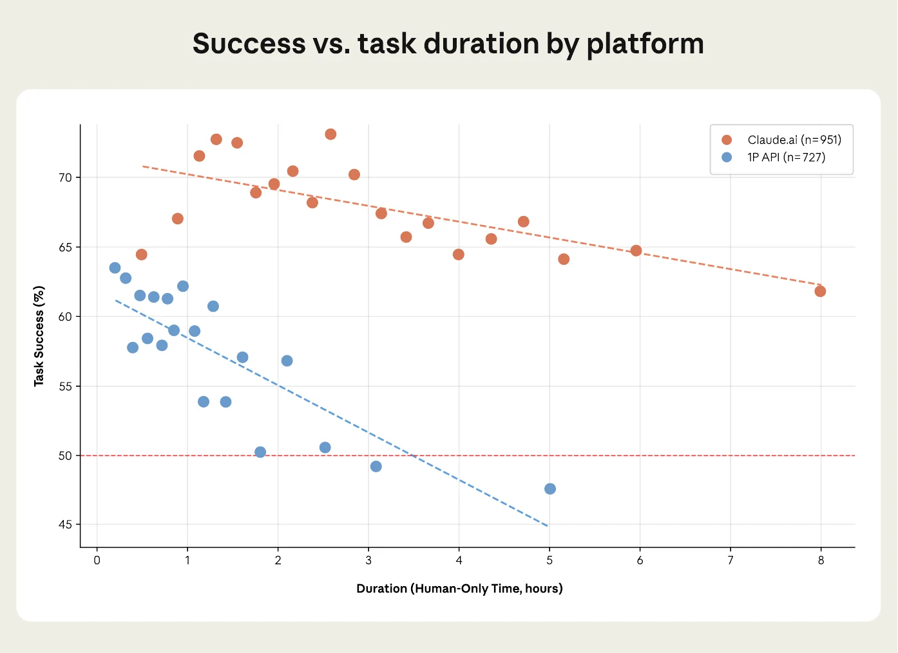

Imagine you are a travel agent. A new tool arrives that can plan a trip, put together a package and work out what it will cost. It is good at it. What is left for you?

Printing tickets and collecting payment.

Now imagine you manage buildings. The same kind of tool takes over your sales records and checks your rents against the market. What is left for you? Negotiating with architects, getting loans, and meeting with the board.

Same technology, opposite result. The travel agent loses the interesting part of the job and keeps the simple part. The property manager loses the paperwork and keeps the part that needs experience.

These two examples come from the fourth Economic Index report by Anthropic, the company that makes the AI model Claude. They looked at one million conversations with Claude from one week in November 2025 and asked what kind of work people were bringing to it. Most of the report is about numbers. But this small exercise, removing the tasks AI can do and looking at what is left, is the part I keep coming back to.

I am looking for my next job right now, so I did what I think everyone does after reading something like this. I tried it on myself.

## The part that looks most like my MBA

My work has mostly been projects between groups of people: a central IT team and the game studios it served, a company and its suppliers, headquarters and a local team. If I write my tasks down honestly, they look roughly like this:

- Write up what was agreed after a meeting
- Compare two tools and make a cost case
- Turn the same questions from different teams into one clear guide
- Prepare status updates for managers
- Find out who really decides, and talk to them
- Sit with a team that is unhappy and work out why
- Notice when "yes" means "maybe"
- Be the person both sides trust when something goes wrong

The first four are things AI already helps me with. I use it every day for exactly this kind of work. The last four are the ones I still have to do myself.

And here is the uncomfortable part. The first four are also the tasks that look most like what I studied. I did an MBA in AI, Data and Analytics. The analysis, the cost case, the clean summary: that is what a business degree trains you for. According to the report, that is also exactly what AI is used for most. Tasks people bring to Claude need on average about one year more education than the average task in the economy (14.4 years against 13.2). The report's own conclusion is that, for most jobs, taking out the AI tasks would leave work that needs less education, not more.

*Figure 4.5 of the report: the blue bars are all tasks in the economy (average 13.2 years of education), the orange bars are the tasks people bring to Claude (average 14.4 years). Source: Appel, Massenkoff, McCrory et al., [The Anthropic Economic Index report: Economic Primitives](https://www.anthropic.com/research/anthropic-economic-index-january-2026-report), Anthropic, January 2026.*

So for most people, the travel agent is the normal case. The property manager is the lucky one.

## Not how many tasks, but which ones

Another idea in the report changed how I think about this. It is called "effective AI coverage", and the example is data entry clerks.

AI only covers two of their nine tasks. That sounds safe. But one of those two is reading and entering data from documents, which is what they spend most of their day on, and AI does it well. So the job is much more exposed than "two out of nine" suggests.

Microbiologists are the opposite. AI covers half of their tasks, but not the one that takes most of their time: hands-on research in the lab.

I like this way of thinking because it is very practical. The question is not "how many of my tasks can AI do?" It is "can AI do the thing that fills my Tuesday?" For a lot of project managers, the honest answer is: some of it. A big part of a normal week is writing things down and sending them to people. That part is getting smaller.

*Figure 4.4 of the report: each dot is one occupation. Above the dashed line, AI covers more of the working day than the number of tasks suggests (data entry keyers). Below it, less (microbiologists). Source: Appel, Massenkoff, McCrory et al., [The Anthropic Economic Index report: Economic Primitives](https://www.anthropic.com/research/anthropic-economic-index-january-2026-report), Anthropic, January 2026.*

## The third that does not work

There is one number in the report that I think gets too little attention. When people use Claude in the normal chat app, the report estimates that it succeeds on the task about 67% of the time. When companies use it automatically through the API, it is 49%. And the harder the task, the lower the success rate.

The report then does something I respect. It takes its own earlier estimate, that AI could add 1.8 percentage points a year to US labour productivity growth over the next ten years, and corrects it for these success rates. The number goes down to between 1.0 and 1.2. Still big, the authors say, but a lot smaller.

The econometrics part of my MBA also makes me want to add one note: Claude was also the one judging whether Claude succeeded. The authors say this openly. They call the measures "directionally accurate", not exact. I think that is fair, but it is worth knowing when you read a number like 67%.

What does a 67% success rate mean in real work? It means someone has to check. And the report says something I agree with completely: the hardest tasks, where AI fails most, are also the tasks where you need an expert to see that it failed. To check a cost case, you need to know how to build one. To check a summary of a meeting, you need to have been in the meeting.

*Figure 4.3 of the report: the longer a task would take a person, the less often Claude succeeds, and the drop is steeper in automated API use (blue) than in the chat app (orange). Source: Appel, Massenkoff, McCrory et al., [The Anthropic Economic Index report: Economic Primitives](https://www.anthropic.com/research/anthropic-economic-index-january-2026-report), Anthropic, January 2026.*

So maybe the analysis part of my job does not disappear. Maybe it changes from doing it to checking it. That only works if I keep being able to do it myself.

## How you ask is how it answers

One more finding I did not expect. The report measures how much education you need to understand a person's question, and how much you need to understand Claude's answer. Across 117 countries, these two numbers are almost the same (a correlation of 0.925).

In plain words: a simple question gets a simple answer, and a smart question gets a smart answer. The AI meets you where you are.

I recognise this from learning Dutch. In my first years, I could only ask simple questions, so I only got simple answers. People were not hiding anything from me. I just did not know enough to ask for more. With AI it seems to work the same way. It does not make the gap between people smaller by itself. If you already know a lot, you get more out of it.

That is also why the report ends with a sentence that I think is the most important one in all 55 pages: giving people access to AI is not enough, they also need the skills to use it well.

## So which one am I?

For now, I think I am closer to the property manager. The parts of my work that AI does well are the parts I was always happy to do faster. The parts it cannot do yet, being in the room, building trust between two groups who do not fully understand each other, are the parts I like most anyway.

But I wrote "for now" for a reason. This report is one week of data from November 2025. I am reading it more than half a year later, and the models have changed again since then. Every new report will move the line a little.

So my plan is not to guess where the line will be. My plan is to stay good at checking the work, and to get even better at the part that needs a person. The travel agent in the report keeps the tickets and the payments. I would rather keep the people.

---

*Source: Ruth Appel, Maxim Massenkoff, Peter McCrory and others, [The Anthropic Economic Index report: Economic Primitives](https://www.anthropic.com/research/anthropic-economic-index-january-2026-report), Anthropic, 15 January 2026. The figures above are taken from the report as published. All numbers in this post come from it.*
